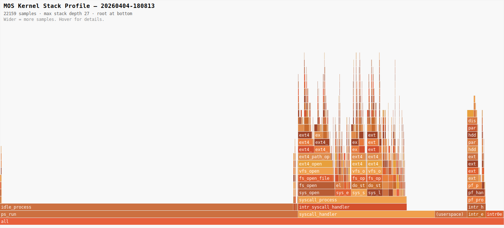

# Kernel Profiling

MOS includes two sampling profilers that attach to QEMU's HMP monitor socket.
Both work by repeatedly pausing the VM, reading CPU registers, then resuming —
so they add no instrumentation to the kernel itself.

| Tool                     | Output                       | Use when                                                         |
| ------------------------ | ---------------------------- | ---------------------------------------------------------------- |
| `tools/profile.py`       | Flat EIP histogram to stdout | Quick sanity check, identifying hot functions                    |
| `tools/profile_stack.py` | Flamegraph SVG in `out/`     | Finding call-chain hotspots, understanding why a function is hot |

---

## Setup

Start the kernel with the monitor socket exposed:

```sh
./run.sh profile
```

This passes `-monitor unix:/tmp/qemu-profiler.sock,server,nowait` to QEMU.
The guest boots normally; the profiler attaches in a second terminal.

---

## Flat EIP profiler — `profile.py`

```sh
./tools/profile.py [--delay MS] [--sock PATH] [--kernel PATH]
```

1. Loads symbols from `out/kernel.dbg`.
2. Connects to `/tmp/qemu-profiler.sock`.
3. Waits for you to press **Enter** — start your workload in the guest first.
4. Samples EIP at the specified interval.
5. Press **Ctrl-C** to stop; the guest resumes automatically.

**Options**

| Flag            | Default                   | Meaning                      |
| --------------- | ------------------------- | ---------------------------- |
| `--delay MS`    | `5`                       | Milliseconds between samples |
| `--sock PATH`   | `/tmp/qemu-profiler.sock` | QEMU monitor socket          |
| `--kernel PATH` | `out/kernel.dbg`          | Debug symbol binary          |

**Example output**

```
Loading symbols from out/kernel.dbg ...
  4821 symbols loaded.
Connecting to QEMU monitor at /tmp/qemu-profiler.sock ...
  Connected.
Start your workload in the guest, then press Enter to begin sampling ...
Sampling every 5.0 ms — Ctrl-C to stop.

  500 samples ...
Interrupted — 500 samples collected.

=================================================================
  Profiling results  (500 samples)
=================================================================
  Function                                          Samples       %
  ------------------------------------------------ -------  ------
  ext4_dir_find_entry                                   48    9.6%
  ext4_generic_open2                                    41    8.2%
  partition_cache_read                                  29    5.8%
  syscall_handler                                       24    4.8%
  ...

  kernel:    487 samples  (97.4%)
  user  :     13 samples  (2.6%)
```

---

## Call-stack flamegraph profiler — `profile_stack.py`

```sh
./tools/profile_stack.py [--delay MS] [--depth N] [--sock PATH] [--kernel PATH]
```

At each sample the profiler:

1. Sends `stop` to QEMU.
2. Reads `EIP` and `EBP`.
3. Walks the EBP frame chain up to `--depth` frames.
4. Sends `cont` to resume the guest.
5. On **Ctrl-C**: sends `cont`, saves the flamegraph, and exits.

The result is written to `out/profile-YYYYMMDD-HHMMSS.svg`.

**Options**

| Flag            | Default                   | Meaning                      |
| --------------- | ------------------------- | ---------------------------- |
| `--delay MS`    | `10`                      | Milliseconds between samples |
| `--depth N`     | `32`                      | Maximum frame-chain depth    |
| `--sock PATH`   | `/tmp/qemu-profiler.sock` | QEMU monitor socket          |
| `--kernel PATH` | `out/kernel.dbg`          | Debug symbol binary          |

**Requirements:** the kernel must be built at `-O0` (the default) so that GCC
emits standard EBP frame pointers. Optimised builds may omit them.

---

## Reading a flamegraph

Open the `.svg` file in any browser. Each rectangle is one function:

- **Width** is proportional to the number of samples in which that function
  appeared anywhere on the call stack — wider means more total time.
- **Height / level** shows the call depth — callers are at the bottom, callees
  at the top.
- **Hover** over any rectangle to see the exact sample count and percentage.

The root bar (`all`) spans the full width and represents 100 % of samples.

---

## Example flamegraph

The flamegraph below was captured during a full SysV init boot of RH9
(22 159 samples, 10 ms interval).



**What this flamegraph shows:**

- **`idle_process` / `ps_run` (58.2 %)** — the system spends most of its time
  idle. SysV init runs shell scripts sequentially; the kernel is waiting for
  child processes between script steps. This is the expected profile for an
  init-dominated workload.

- **`sys_open` (7.3 %)** — the dominant active syscall. The chain
  `fs_open → vfs_open → ext4_open → ext4_path_open → ext4_generic_open2` is
  driven by shell scripts opening configuration files, device nodes, and
  executables.

- **`sys_stat64` / `sys_lstat64` (3.1 % each)** — SysV shell scripts call
  `stat` heavily to check for file existence before executing commands.
  Both resolve through the same `ext4_path_open` path as `open`.

- **`sys_execve` (3.2 %)** — spawning new processes for each init script step.

- **Page faults (`intr0e_stub`, 3.5 %)** — demand-paging during process startup.

- **`(userspace)` (6.4 %)** — samples where the CPU was in user mode (shell,
  init scripts, spawned processes).

- **`ext4_resolve_prefix` (3.2 %)** — intermediate symlink resolution called
  on every `open` and `stat`; visible as a separate tower because it opens each
  path component once just to confirm it is not a symlink.

The active (non-idle) kernel time is dominated by filesystem operations —
`open` and `stat` together account for roughly half of all non-idle samples,
all rooted in ext4 directory traversal.

---

## Tips

**Increase sampling density for short workloads**

```sh
./tools/profile_stack.py --delay 2
```

**Profile a specific workload without boot noise**

Log in to the guest first, set up the workload, then press Enter in the
profiler terminal to begin sampling. Press Ctrl-C when the workload finishes.

**Correlate with source**

Symbol names come from `nm out/kernel.dbg`. To map a symbol to its source
location:

```sh
addr2line -e out/kernel.dbg -f $(nm out/kernel.dbg | grep ' ext4_dir_find_entry$' | awk '{print "0x"$1}')
```
